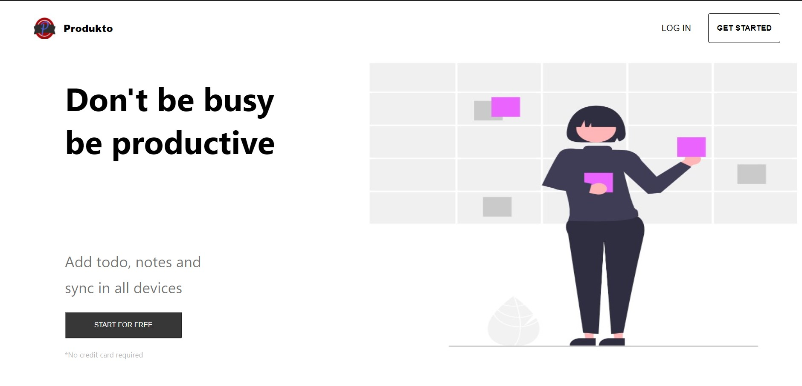

<p align="center">
    
    <br>
    <br>
     <a href="https://app.netlify.com/sites/getprodukto/deploys"></a>

</p>

A Progressive Web Application to add your Todos and Notes in order to work more efficiently.

## SCREENSHOTS

<p align="center">

<br>

</p>

## :hatching_chick: Prerequisites

- [node](https://nodejs.org/en/) >= 12.18.0
- npm >= 6.14.4

## :zap: Installation

1. Clone / Download [this](https://github.com/Amanthukral12/productivity-app) repo.
2. Inside the project open a terminal and run:
   ```
   npm install
   ```
   This will install all the project dependencies.
3. Create a **.env** file in the project root folder and add the following:

   ```
   REACT_APP_FIREBASE_API_KEY=yourApiKey
   REACT_APP_FIREBASE_AUTH_DOMAIN=yourAuthDomain
   REACT_APP_FIREBASE_PROJECT_ID=yourProjectId
   REACT_APP_FIREBASE_STORAGE_BUCKET=yourStorageBucket
   REACT_APP_FIREBASE_MESSAGING_SENDER_ID=yourMessagingSenderId
   REACT_APP_FIREBASE_APP_ID=yourAppId
   REACT_APP_FIREBASE_MEASUREMENT_ID=yourMeasurementId
   ```

4. To start the development server run:
   ```
   npm start
   ```

## :man_in_tuxedo: Author

[](https://twitter.com/aman_thukral12)

[](https://www.linkedin.com/in/aman-thukral-574b37150/)
